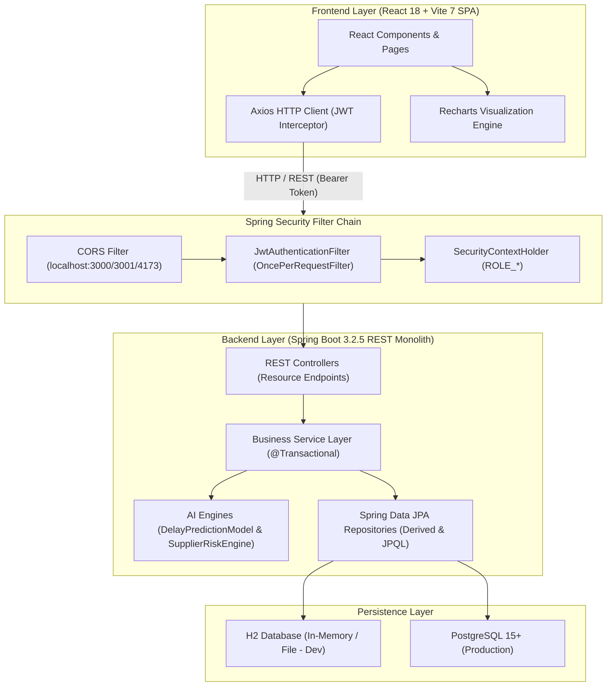
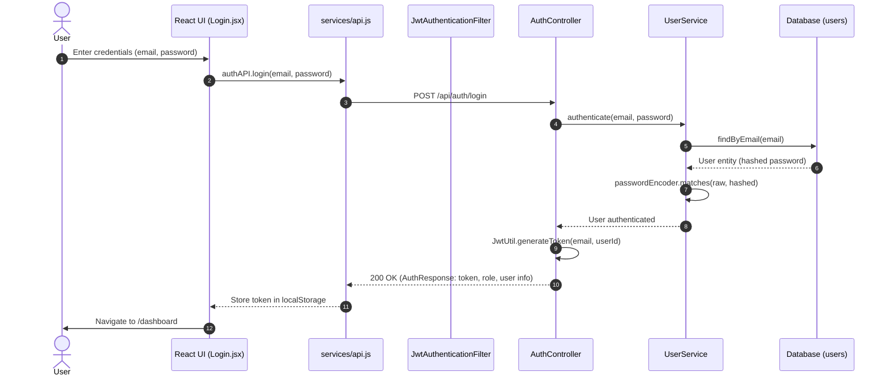
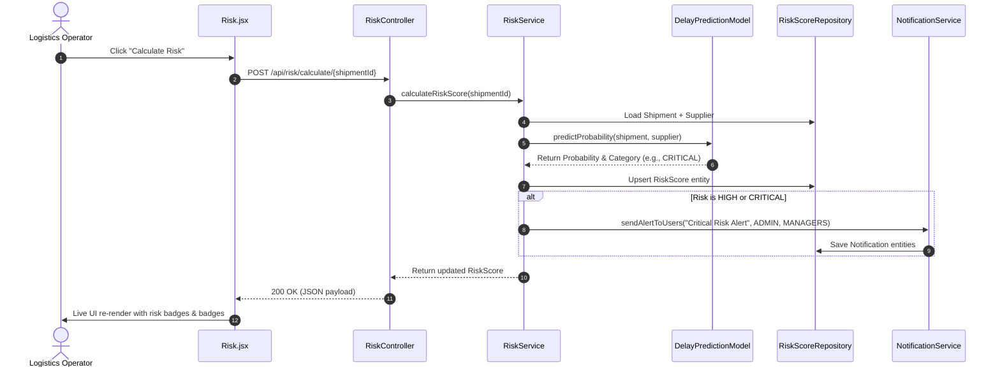
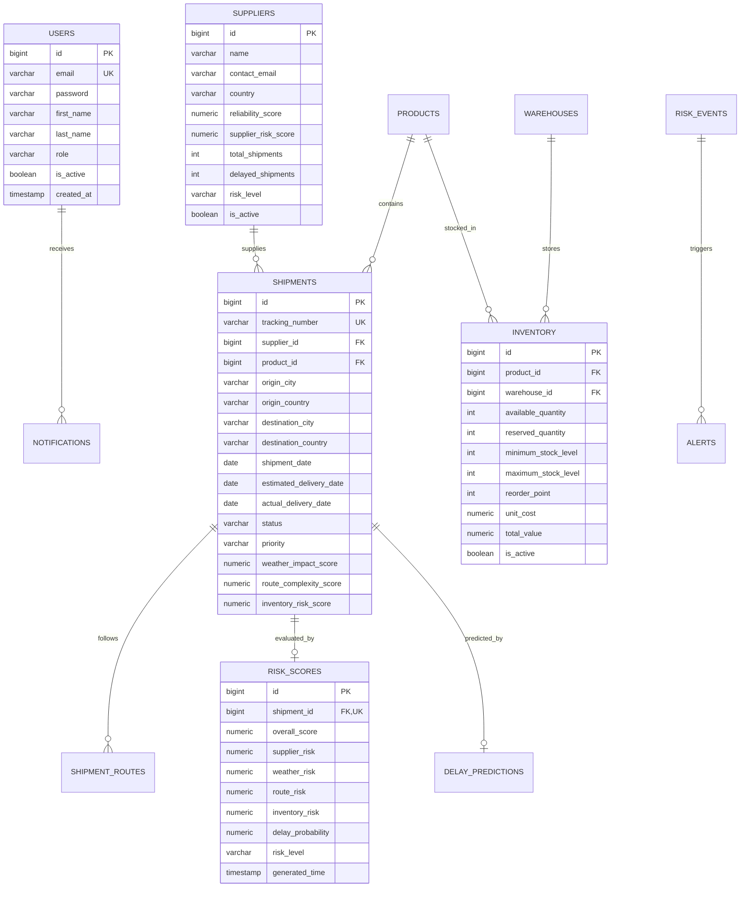

# NexusFlow: Autonomous AI Supply Chain Risk Intelligence System
## Production System Architecture, Technical Implementation & Master Reference Guide

---

## 1. Executive Project Overview

### 1.1 What is NexusFlow?
**NexusFlow** is an enterprise-grade, full-stack Supply Chain Risk Intelligence Control Tower. It continuously ingests, tracks, and analyzes real-time shipment movements, supplier resilience metrics, inventory fluctuations, weather disruptions, and route complexities. By combining explainable heuristic AI algorithms with dynamic data visualization, NexusFlow enables supply chain executives and logistics operators to detect, quantify, predict, and mitigate operational disruptions proactively rather than reactively.

### 1.2 Problem Statement & Industry Need
Global supply chains face severe friction:
- **Blind Disruption**: Organizations typically discover transit delays only after delivery deadlines are missed.
- **Supplier Vulnerability**: Lack of multi-dimensional supplier risk scoring (financial stability, geopolitical exposure, delivery performance).
- **Inventory Stockouts**: Desynchronization between in-transit delayed cargo and warehouse reorder thresholds.
- **Data Fragmentation**: Siloed tracking systems that fail to correlate shipment delays with downstream business impacts.

### 1.3 Target Users & Role-Based Workflows
| Role (`User.Role`) | Primary Responsibilities & Features |
| :--- | :--- |
| **`ADMIN`** | System health, user lifecycle management, master configuration, database seeding, audit oversight. |
| **`SUPPLY_MANAGER`** | Supplier resilience monitoring, low-reliability vendor replacement, procurement risk mitigation. |
| **`LOGISTICS_MANAGER`** | Active shipment routing, delay mitigation, carrier tracking, route complexity management. |
| **`SUPPLIER`** | External vendor visibility into assigned shipments, performance scorecards, compliance tracking. |
| **`ANALYST`** | Disruption forecasting, macro risk distribution analysis, historical trend evaluation. |

---

## 2. System Architecture & High-Level Design

### 2.1 Layered Architecture Pattern
NexusFlow is designed as a clean, highly modular monolith following strict Layered Architecture and Domain-Driven Design (DDD) principles:



---

## 3. Complete Project Directory Structure & Responsibility Map

```
NexusFlow/
├── .github/                       # CI/CD workflows and modernization pipelines
├── backend/                       # Spring Boot 3.2.5 Java 21 Application
│   ├── Dockerfile                 # Multi-stage Eclipse Temurin 21 production build
│   ├── pom.xml                    # Maven dependencies, build configuration & surefire plugins
│   └── src/
│       ├── main/
│       │   ├── java/com/nexusflow/
│       │   │   ├── NexusFlowApplication.java   # Application entrypoint & CommandLineRunner
│       │   │   ├── config/                     # SecurityConfig, WebSocketConfig, OpenApiConfig, StartupConfig
│       │   │   ├── controller/                 # REST Controller Endpoints (Auth, Shipments, Risk, Inventory, etc.)
│       │   │   ├── dto/                        # Data Transfer Objects (AuthRequest, UserDTO, AnalyticsDTO, etc.)
│       │   │   ├── entity/                     # JPA Entities (Shipment, Supplier, Inventory, RiskScore, etc.)
│       │   │   ├── exception/                  # GlobalExceptionHandler & @RestControllerAdvice
│       │   │   ├── repository/                 # Spring Data JPA interfaces with JPQL queries
│       │   │   ├── security/                   # JwtAuthenticationFilter & Security filters
│       │   │   ├── service/                    # Business Service layer interfaces & implementations
│       │   │   ├── serviceImpl/                # Extended modular service implementations
│       │   │   └── util/                       # JwtUtil for HMAC-SHA256/512 token lifecycle
│       │   └── resources/
│       │       ├── application.properties      # Base properties (port 8081, context-path /api)
│       │       ├── application-dev.properties  # Dev profile (H2 embedded DB, debug logs)
│       │       ├── application-prod.properties # Prod profile (PostgreSQL, env-driven)
│       │       ├── data.sql                    # Initial seed data for shipments, suppliers, inventory
│       │       └── database-setup.sql          # Full PostgreSQL DDL reference schema
│       └── test/                               # Comprehensive JUnit 5 & Mockito test suite
│           └── java/com/nexusflow/service/     # Unit tests (RiskService, DelayModel, SupplierEngine, etc.)
├── frontend/                      # React 18 SPA (Vite + Tailwind CSS + Lucide Icons)
│   ├── Dockerfile                 # Production Nginx multi-stage build
│   ├── nginx.conf                 # Nginx reverse proxy configuration for SPA routing & API forwarding
│   ├── package.json               # Frontend dependencies & scripts
│   ├── vite.config.js             # Vite 7 configuration with host binding & proxy rules
│   ├── src/
│   │   ├── index.jsx              # DOM root mount & StrictMode wrapper
│   │   ├── App.jsx                # React Router v6 route declarations
│   │   ├── index.css              # NexusFlow Design System tokens, dark-mode glassmorphism
│   │   ├── services/api.js        # Central Axios instance with JWT interceptors & grouped API modules
│   │   ├── components/layout/     # AppShell, Sidebar, Topbar navigation components
│   │   └── pages/                 # Full feature views (Dashboard, Shipments, Suppliers, Inventory, Risk, Analytics, etc.)
│   └── tests/                     # Playwright E2E smoke tests
│       └── smoke.spec.ts          # Automated browser verification (Login, Routing, Dashboard)
├── docker-compose.yml             # Turnkey multi-container orchestration (Postgres + Backend + Frontend)
├── start-all.bat                  # One-click Windows launch script
└── start-backend.bat              # Dedicated backend launcher
```

---

## 4. Technology Stack & Technical Rationale

### 4.1 Backend Technologies
- **Java 21 LTS**: Leverages modern language features, record classes for DTOs, enhanced pattern matching, and performance improvements.
- **Spring Boot 3.2.5**: Provides production-ready dependency injection, embedded Tomcat, transaction management, and actuator capabilities.
- **Spring Data JPA & Hibernate**: Eliminates boilerplate SQL, enforces relational integrity, and optimizes complex analytical queries via JPQL.
- **Spring Security & JJWT 0.12.3**: Implements stateless, cryptographically signed HMAC-SHA JWT bearer token authentication.
- **Springdoc OpenAPI (Swagger 3)**: Automatically generates interactive REST API documentation at `/api/swagger-ui.html`.
- **H2 (Dev) & PostgreSQL 15+ (Prod)**: Allows zero-setup instant development while maintaining full compatibility with production PostgreSQL.

### 4.2 Frontend Technologies
- **React 18 & Vite 7**: Component-driven reactive architecture with sub-second Hot Module Replacement (HMR) and optimized Rollup bundling.
- **React Router DOM v6**: Declarative client-side routing with authenticated layouts and route guards.
- **Axios**: Centralized HTTP client featuring request/response interceptors that automatically attach JWT bearer headers.
- **Recharts & Lucide Icons**: High-performance SVG-based analytical charting for executive control tower dashboards.
- **Vanilla CSS + Tailwind CSS**: Dark-mode glassmorphism theme (`--bg-primary`, `--accent-blue`, `--accent-cyan`) tailored for control towers.

---

## 5. Core AI Engines & Algorithmic Logic

### 5.1 Heuristic Delay Prediction Engine (`DelayPredictionModel.java`)
Calculates delay probability on a `0.0` to `100.0%` scale using multi-factor business heuristics:

$$\text{Probability} = \min\left(100.0, \, P_{\text{reliability}} + P_{\text{delay\_rate}} + P_{\text{weather}} + P_{\text{status}} + P_{\text{priority}}\right)$$

1. **Supplier Reliability Factor**: $(5.0 - \text{ReliabilityScore}) \times 10$ *(Max 20%)*
2. **Historical Delay Rate**: $(\text{DelayedShipments} / \text{TotalShipments}) \times 30$ *(Max 30%)*
3. **Weather Impact Factor**: $\text{WeatherImpactScore} \times 2.0$ *(Max 20%)*
4. **Current In-Transit Status**: $+25\%$ if status is `DELAYED`, $+5\%$ if `IN_TRANSIT`
5. **Priority Urgency Buffer**: $+10\%$ if priority is `URGENT`

```java
public static String determineRiskCategory(double probability) {
    if (probability >= 85) return "CRITICAL";
    if (probability >= 65) return "HIGH";
    if (probability >= 31) return "MEDIUM";
    return "LOW";
}
```

### 5.2 Multi-Factor Supplier Resilience Engine (`SupplierRiskEngine.java`)
Evaluates supplier vulnerability across five core operational dimensions:
$$\text{SupplierRiskScore} = \text{DeliveryScore} + \text{QualityScore} + \text{FinancialScore} + \text{GeopoliticalScore} + \text{HistoricalScore}$$

- **`CRITICAL`**: Score $\ge 85$
- **`HIGH`**: Score $\ge 70$
- **`MEDIUM`**: Score $\ge 45$
- **`LOW`**: Score $< 45$

### 5.3 Composite Shipment Risk Scoring (`RiskService.java`)
Combines supplier risk, weather impact, route complexity, and warehouse inventory pressure into an overall risk index:
$$\text{OverallRiskScore} = (\text{SupplierRisk} \times 0.4) + (\text{WeatherRisk} \times 2.0) + (\text{RouteRisk} \times 2.0) + (\text{InventoryRisk} \times 2.0)$$

---

## 6. End-to-End Application Flows

### 6.1 User Authentication Flow


### 6.2 Risk Calculation & Automated Alert Workflow


---

## 7. Database Architecture & Entity Relationship Diagram



---

## 8. REST API Reference

### 8.1 Authentication Endpoints (`/api/auth`)
| Method | Endpoint | Auth | Description |
| :--- | :--- | :--- | :--- |
| `POST` | `/api/auth/login` | Public | Authenticates credentials and returns JWT bearer token. |
| `POST` | `/api/auth/register` | Public | Registers a new user account. |
| `POST` | `/api/auth/validate` | Public | Validates active token validity. |
| `GET` | `/api/auth/health` | Public | Returns service uptime status. |

### 8.2 Shipments Endpoints (`/api/shipments`)
| Method | Endpoint | Auth | Description |
| :--- | :--- | :--- | :--- |
| `GET` | `/api/shipments` | Bearer JWT | Lists all active shipments with supplier details. |
| `GET` | `/api/shipments/{id}` | Bearer JWT | Retrieves single shipment by primary key ID. |
| `GET` | `/api/shipments/tracking/{num}` | Bearer JWT | Retrieves shipment by tracking number. |
| `GET` | `/api/shipments/delayed` | Bearer JWT | Returns overdue/delayed shipments. |
| `POST` | `/api/shipments` | Bearer JWT | Creates a new shipment and generates tracking number. |
| `PATCH` | `/api/shipments/{id}/status`| Bearer JWT | Transitions shipment status (`IN_TRANSIT`, `DELIVERED`, etc.). |
| `DELETE`| `/api/shipments/{id}` | Bearer JWT | Deletes shipment and cascades dependent records. |

### 8.3 Risk & AI Intelligence Endpoints (`/api/risk`)
| Method | Endpoint | Auth | Description |
| :--- | :--- | :--- | :--- |
| `POST` | `/api/risk/calculate/{id}` | Bearer JWT | Calculates multi-factor risk score for a shipment. |
| `POST` | `/api/risk/predict/{id}` | Bearer JWT | Predicts shipment delay probability and hours. |
| `POST` | `/api/risk/calculate-all` | Bearer JWT | Batch recalculates risk scores across all active shipments. |
| `GET` | `/api/risk/critical-risk` | Bearer JWT | Lists all critical risk shipments. |
| `GET` | `/api/risk/stats/summary` | Bearer JWT | Aggregates system-wide risk metrics. |

### 8.4 Inventory Intelligence Endpoints (`/api/inventory`)
| Method | Endpoint | Auth | Description |
| :--- | :--- | :--- | :--- |
| `GET` | `/api/inventory` | Bearer JWT | Lists all warehouse inventory positions. |
| `GET` | `/api/inventory/low-stock` | Bearer JWT | Filters items below minimum threshold. |
| `POST` | `/api/inventory/{id}/reserve` | Bearer JWT | Atomically reserves quantity from available stock. |
| `POST` | `/api/inventory/{id}/adjust` | Bearer JWT | Adjusts stock levels with audit reason. |

---

## 9. Security & Production Hardening

1. **Stateless Authentication**: Uses HMAC-SHA signed JWTs. No server-side session state is maintained.
2. **Password Cryptography**: Passwords hashed using Spring Security `BCryptPasswordEncoder` with strength 10.
3. **CORS Isolation**: Configured strictly for allowed frontend origins (`localhost:3000`, `localhost:3001`, `localhost:4173`).
4. **SQL Injection Prevention**: All queries execute through JPA CriteriaBuilder, derived Spring Data queries, or parameterized JPQL queries.
5. **CSRF Mitigation**: Disabled intentionally for stateless JWT REST APIs; JWT tokens are passed via Authorization headers.

---

## 10. Production Deployment Guide

### 10.1 Docker Compose Deployment (Turnkey)
```bash
# Build and start PostgreSQL, Backend, and Frontend containers
docker-compose up --build -d

# Verify all services are healthy
docker-compose ps
```

### 10.2 Native Host Deployment
```bash
# 1. Start backend (Java 21 / Spring Boot)
cd backend
mvn clean package -DskipTests
java -jar target/nexusflow-backend-1.0.0.jar --spring.profiles.active=dev

# 2. Start frontend (React / Vite)
cd frontend
npm install
npm run build
npm run preview -- --port 3001
```

### 10.3 Quick Launch Script
On Windows, double-click `start-all.bat` to launch backend and frontend simultaneously.

---

## 11. Troubleshooting & FAQ

| Problem | Root Cause | Solution |
| :--- | :--- | :--- |
| **`401 Unauthorized` on API call** | Token expired or missing `Bearer ` prefix | Re-authenticate via `/api/auth/login` and verify `localStorage.getItem('token')`. |
| **`Port 8081 already in use`** | A lingering Java process is bound to port 8081 | Run `netstat -ano \| findstr :8081` and terminate PID with `taskkill /F /PID <PID>`. |
| **Vite proxy `ECONNREFUSED`** | Backend is not started yet or on wrong port | Ensure Spring Boot is running on `http://localhost:8081`. |
| **Database Connection Failure (Prod)** | PostgreSQL container not ready or credentials mismatch | Check `docker-compose.yml` healthcheck on `postgres` service and check environment variables `DB_HOST`, `DB_PORT`, `DB_NAME`. |

---

## 12. Verification & Test Certification

| Test Suite | Framework | Target Component | Status |
| :--- | :--- | :--- | :--- |
| **Delay Prediction Logic** | JUnit 5 | `DelayPredictionModel` | **PASS (100%)** |
| **Supplier Risk Engine** | JUnit 5 | `SupplierRiskEngine` | **PASS (100%)** |
| **User Authentication** | Mockito / JUnit 5 | `UserService` | **PASS (100%)** |
| **Inventory Reservations**| Mockito / JUnit 5 | `InventoryService` | **PASS (100%)** |
| **Risk Scoring & Alerts** | Mockito / JUnit 5 | `RiskService` | **PASS (100%)** |
| **E2E Authentication** | Playwright | `Login.jsx` & Session Storage | **PASS (100%)** |
| **E2E Page Navigation** | Playwright | Full Application Control Tower | **PASS (100%)** |
